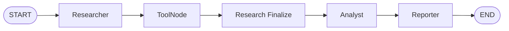
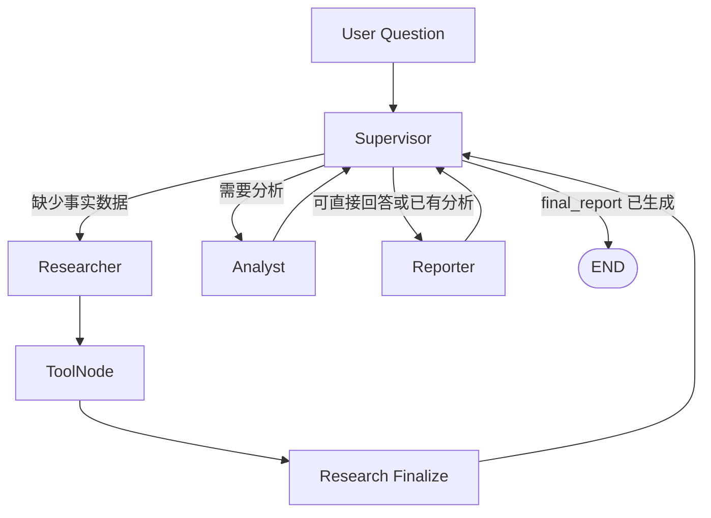

# Crypto Agent

基于 **MiniMax M2.7 + LangGraph + LangChain + Chroma + FastAPI + Streamlit** 构建的加密货币分析 Agent 学习项目。

项目围绕同一个加密市场分析场景，逐步实现并对比手写 ReAct、LangChain ReAct、LangGraph Function Calling、固定流程 Multi-Agent 与 Supervisor Multi-Agent，并通过统一 Eval 记录工具调用、回答质量、路由轨迹和失败模式。

> 项目当前版本：**v0.11 / Week 11**
> 当前重点：Multi-Agent 协作、可解释路由与 Eval 对比。
> 项目定位：工程化学习项目，不提供自动交易或投资建议。

## 项目演进与 Agent 形态

| 形态 | 实现方式 | 当前定位 | 特点 |
|---|---|---|---|
| 手写 ReAct | 纯 Python + 文本解析 | 历史对照 | 可理解 ReAct 循环与 parser 脆弱性 |
| LangChain ReAct | LangChain 0.3 + ReAct parser | 失败模式对照 | 在 MiniMax 上存在格式遵从与 parser 问题 |
| LangGraph 单 Agent | StateGraph + Function Calling + ToolNode | 单 Agent 基线 | 工具调用结构化、状态图清晰、后续主线基础 |
| 固定流程 Multi-Agent | Researcher → Analyst → Reporter | 稳定 Multi-Agent 基线 | 职责明确、便于调试，但简单任务会过度编排 |
| Supervisor Multi-Agent | Supervisor 按 State 动态路由 | 复杂任务编排实验 | 可跳过非必要角色，但存在协调开销与路由波动 |

## Week 10：三版 Agent Eval 基线

v0.9 对 12 个非 context case 进行了三版 Agent 对比：

| 版本 | 框架 | 工具调用协议 | Eval 规则通过率 | Judge 平均分（acc / comp / rel） |
|---|---|---|---|---|
| 手写版（Week 5-6） | 纯 Python | ReAct 文本协议 | 83%（10/12） | 8.9 / 9.4 / 9.7 |
| LangGraph 单 Agent（Week 9） | LangGraph | Function Calling | 75%（9/12） | 8.9 / 8.9 / 9.8 |
| LangChain ReAct（Week 7） | LangChain 0.3 | ReAct 文本协议 | 33%（4/12） | 7.6 / 10.0 / 9.8* |

\* LangChain Judge 分数仅基于成功执行的 case；其余 case 因 parser error、工具调用失败或运行失败无法作为有效回答评分。

结论：手写版在该批样本中规则通过率更高，但 LangGraph 的 Function Calling、ToolNode、StateGraph 和状态管理更适合作为后续工程主线；LangChain ReAct 保留为模型格式遵从失败的对照组。

## Week 11：Multi-Agent 协作

### 角色划分

| 角色 | 职责 | 工具权限 |
|---|---|---|
| Supervisor | 读取共享 State，选择下一步 Agent；不做分析，不生成最终回答 | 无 |
| Researcher | 获取价格、币种详情、市场总览和知识库资料 | `get_price`、`get_coin_detail`、`get_market`、`search_rag` |
| Analyst | 基于已获取事实区分数据、推断、风险与信息缺口 | 无 |
| Reporter | 将事实和分析组织成面向用户的最终报告 | 无 |

### 固定流程版本



固定流程适合做稳定基线：`Researcher → Analyst → Reporter` 的职责边界清楚、易调试、易复现。但简单问题也会经过 Analyst，存在过度编排。

### Supervisor 动态路由版本



Supervisor 从共享 State 中读取：

```text
market_data / research_notes / analysis_result / final_report
errors / route_count / max_route_count
```

它输出结构化 JSON 路由决策，再由 Python 白名单校验并使用 `Command(goto=...)` 跳转。

当前实现包含三层收敛保护：

1. `final_report` 生成后由 Python 强制 `END`；
2. State 记录数据、分析、报告等阶段产出；
3. 达到 `max_route_count` 后强制 Reporter 基于已有信息输出。

## Week 11 Multi-Agent Eval

新增独立评估集，对比：

1. 单 LangGraph Agent；
2. 固定流程 Multi-Agent；
3. Supervisor Multi-Agent。

测试覆盖简单价格查询、市场概览、复杂 BTC 分析和 RAG 概念解释，共 4 个 case、12 条记录。

| 架构 | Rule Pass | 通过率 | 主要观察 |
|---|---:|---:|---|
| 单 LangGraph Agent | 3 / 4 | 75% | 简单任务链路短；复杂工具选择未必完整 |
| 固定流程 Multi-Agent | 3 / 4 | 75% | 路径稳定；简单任务会经过全部业务角色 |
| Supervisor Multi-Agent | 3 / 4 | 75% | 能跳过 Analyst；复杂题工具覆盖完整；可能重复调度 |

关键发现：

- 对“BTC 当前价格是多少？”：Supervisor 成功走 `Researcher → Reporter`，跳过 Analyst；
- 对“分析 BTC 当前价格、24 小时涨跌和市场情况”：Supervisor 调用了 `get_price + get_coin_detail + get_market`，并走完整 `Researcher → Analyst → Reporter`；
- 对市场总览问题：Supervisor 曾重复派发 Researcher，导致 `get_market` 重复调用，说明 LLM 路由仍需要任务完成标记、工具去重和规则兜底。

因此，本项目将 Multi-Agent 定位为**复杂任务的可解释编排模式**，而不是单 Agent 的无条件替代：

- 简单事实查询：单 Agent 或轻量流程通常更高效；
- 需要标准化完整报告：固定流程更稳定；
- 任务复杂度不固定、需按中间结果决定后续步骤：Supervisor 更有价值。

详细文档：

- [Week 11 设计笔记](docs/week11_notes.md)
- [Week 11 Multi-Agent Eval 对比报告](docs/week11_multi_agent_eval.md)
- [Week 10 失败分析](docs/failure_analysis.md)

## 核心功能

- LangGraph 单 Agent：StateGraph + Function Calling + ToolNode
- 固定流程 Multi-Agent：Researcher / Analyst / Reporter
- Supervisor Multi-Agent：State 驱动动态路由、`Command(goto=...)`、最大轮数收敛
- 工具调用：实时价格、全市场概览、单币种详情、RAG 知识库检索
- Parallel tool calls：一轮 LLM 推理可并行请求多个工具
- Checkpointer + thread_id：支持 LangGraph 多轮会话状态管理
- interrupt/resume：工具调用前人工确认
- Eval 体系：规则评估、LLM-as-Judge、失败重跑、Multi-Agent 路由轨迹
- FastAPI 服务、Streamlit 界面、交互式 Agent CLI
- 深度行情分析工具：工具内部调用 LLM，作为 subagent 雏形

## 安装

```bash
git clone https://github.com/YuanHHHH/crypto-agent.git
cd crypto-agent
python3.11 -m venv .venv
source .venv/bin/activate
pip install -r requirements.txt
python scripts/build_rag_index.py
```

建议使用 Python 3.11+。macOS 系统 Python 3.9 的 LibreSSL 可能导致 CoinGecko TLS 请求不稳定，详见 `TROUBLESHOOTING.md`。

### 环境变量

在项目根目录创建 `.env`：

```env
CG_API=你的CoinGecko_Demo_API_Key
CG_BASE_URL=https://api.coingecko.com/api/v3

LLM_API_KEY=你的MiniMax_API_Key
LLM_BASE_URL=https://api.minimaxi.com/v1/chat/completions
LLM_MODEL=MiniMax-M2.7

KIMI_API_KEY=你的Kimi_API_Key
KIMI_BASE_URL=https://api.moonshot.cn/v1/chat/completions
```

## 使用

```bash
# 单 LangGraph Agent CLI（推荐的单 Agent 基线）
python -m src.agent.langgraph_agent

# 固定流程 Multi-Agent CLI
python src/agent/langraph_multi_agent.py

# Supervisor Multi-Agent CLI
python src/agent/langgraph_supervisor_multi_agents.py

# Week 10 三版 Agent Eval
python scripts/run_eval.py

# Week 11 Multi-Agent Eval
python scripts/run_multi_agent_eval.py

# Streamlit Web 界面
streamlit run src/app.py

# 手写 ReAct Agent CLI
python -m src.agent_cli

# FastAPI 服务
uvicorn src.api:app --reload
```

## Eval 体系

### Week 10：三版 Agent 基线评估

评估集：`data/eval/eval_set_v1.jsonl`，15 个 case，覆盖：

| 类型 | case 数 | 说明 |
|---|---:|---|
| basic | 5 | 单工具、多工具、无工具调用 |
| context | 3 | 多轮上下文记忆 |
| boundary | 4 | 拼写错误、不存在币种、超出范围、模糊问题 |
| complex | 3 | 概念解释与实时数据组合、多工具串行 |

双轨评估：

- **Rule Eval**：工具路径、字段完整性、步骤、错误标记和关键词检查；
- **LLM-as-Judge**：accuracy、completeness、relevance 三维语义评分。

### Week 11：Multi-Agent 路由评估

文件：

```text
data/eval/eval_set_multi_agent_v1.jsonl
data/eval/eval_result_multi_agent_v1.jsonl
scripts/run_multi_agent_eval.py
```

除复用 Rule Eval 与 Judge 外，额外记录：

```text
node_path
agent_path
route_decisions
routing_result
```

这些信息用于解释“是否正确经过 Researcher / Analyst / Reporter”“是否跳过不必要角色”“是否出现重复调度或循环”。

## 项目结构

```text
crypto-agent/
├── src/
│   ├── agent/
│   │   ├── agent_runner.py
│   │   ├── langchain_agent.py
│   │   ├── langgraph_agent.py
│   │   ├── langraph_multi_agent.py
│   │   ├── langgraph_supervisor_multi_agents.py
│   │   ├── eval_rules.py
│   │   ├── eval_judge.py
│   │   └── eval_runners.py
│   ├── api.py
│   └── app.py
├── data/
│   ├── eval/
│   │   ├── eval_set_v1.jsonl
│   │   ├── eval_set_multi_agent_v1.jsonl
│   │   └── eval_result_multi_agent_v1.jsonl
│   └── traces/
├── scripts/
│   ├── run_eval.py
│   ├── run_multi_agent_eval.py
│   └── rerun_failed_eval.py
├── docs/
│   ├── week11_notes.md
│   ├── week11_multi_agent_eval.md
│   └── failure_analysis.md
├── README.md
└── TROUBLESHOOTING.md
```

## 技术栈

```text
Python 3.11
LangGraph
LangChain 0.3
MiniMax M2.7（OpenAI-compatible Function Calling）
ChromaDB
sentence-transformers
FastAPI
Streamlit
Pydantic
pytest
```

## 开发进度

- Week 1-2：Python、FastAPI、CoinGecko API、数据模型与测试
- Week 3：MiniMax LLM 接入与 AI 行情分析
- Week 4：Streamlit 前端
- Week 5-6：手写 ReAct Agent、工具注册、记忆、trace、质量评估
- Week 7：LangChain ReAct 重构与框架对比
- Week 8：RAG 知识库与 Agent 路由
- Week 9：LangGraph、Function Calling、Checkpointer、interrupt/resume
- Week 10：Eval 体系（标注集、Rule Eval、LLM-as-Judge、失败分类重跑）
- **Week 11：固定流程 Multi-Agent、Supervisor 路由、Multi-Agent Eval、M1 完成**
- Week 12：Skill 最小单元与 MCP Server Demo
- Week 13：Docker、部署、配置管理与记忆持久化
- 7 月 10 日：项目冻结，转入算法、系统设计与面试冲刺

## 已知边界与后续方向

当前项目是学习与工程验证项目，重点不在堆叠功能，而在保留架构取舍和失败分析。

后续优先事项：

1. Skill：将“工具 + Prompt + 工作流 + 配置”封装为可插拔能力单元；
2. MCP：将一个现有工具改造成可由独立 MCP Client 调用的 Server；
3. Docker：实现依赖、配置和运行环境的容器化；
4. Memory：从 InMemorySaver 演进到本地持久化存储；
5. 路由增强：为 Supervisor 补充任务完成标记、工具去重与确定性规则兜底。

## 免责声明

本项目仅用于学习 Agent 工程、工具调用、评估和编排设计。市场数据可能存在延迟或错误；项目输出不构成任何投资建议。
