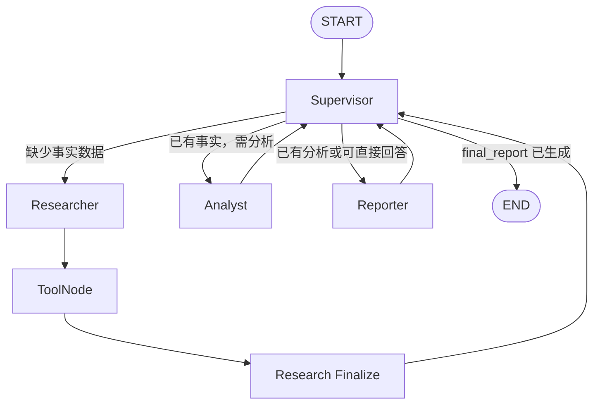

# Week 11：Multi-Agent 设计、实现与评估笔记

**阶段目标**：将 crypto-agent 从单 Agent 工具调用形态扩展为可解释的 Multi-Agent 协作，并用统一 Eval 对比单 Agent、固定流程 Multi-Agent 与 Supervisor Multi-Agent 的优缺点。
**本周里程碑**：M1 Multi-Agent 可运行与可评估。
**完成状态**：已完成。

---

## 1. 本周完成内容

### 1.1 多 Agent 架构模式学习与选型

本周对比了三种常见 Multi-Agent 架构：

| 模式 | 协调方式 | 适用场景 | 主要问题 |
|---|---|---|---|
| Supervisor | 中央协调者根据 State 决定下一位 Agent | 任务步骤具有条件分支、需要根据中间结果动态编排 | 增加协调调用与路由不稳定性 |
| Hierarchical | 多层 Supervisor 分层拆解任务 | 长链路、复杂项目分解、多个子团队 | 链路长、摘要失真风险高、调试复杂 |
| Swarm | 无中心 Agent 直接 handoff | 角色对等、目标开放、需要灵活转交 | 易循环、上下文与责任边界较难收敛 |

本项目选择 **Supervisor 模式**，并采用“按职责”划分角色：

- **Researcher**：只负责选择和调用市场数据、知识库检索工具；
- **Analyst**：只基于已有事实进行推断、风险识别与信息缺口说明；
- **Reporter**：只把事实和分析结果组织为面向用户的最终报告；
- **Supervisor**：只读取共享 State 并决定下一步，不调用工具、不做市场分析、不直接回答用户。

选择原因：当前 crypto 分析问题天然存在“先获取事实，再判断是否需要分析，最后输出”的过程；按职责拆分能减少单个 Prompt 同时承担工具选择、推理和表达时的混乱。

---

## 2. Multi-Agent State 与职责边界

共享 State 的核心字段：

| 字段 | 含义 | 主要写入者 |
|---|---|---|
| `user_question` | 用户原始问题 | 初始化 |
| `market_data` | 价格、币种详情、市场总览等结构化事实 | Researcher + Finalize |
| `research_notes` | RAG 检索到的补充资料 | Researcher + Finalize |
| `analysis_result` | Analyst 的事实、推断、风险和信息缺口 | Analyst |
| `final_report` | 面向用户的最终回答 | Reporter |
| `errors` | 工具解析或数据异常 | Finalize |
| `route_count` / `max_route_count` | 路由次数与循环保护 | Supervisor |
| `next_agent` / `route_reason` | Supervisor 的路由决策与原因 | Supervisor |
| `messages` | LangGraph 协议消息与工具调用轨迹 | 各节点 |

设计原则：

1. `messages` 用于 LangGraph 协议和调试轨迹，不把它当成唯一业务数据源。
2. 领域结果写入明确的 State 字段，避免 Analyst 和 Reporter 从冗长消息历史中猜测事实。
3. Analyst 不调用市场工具，Reporter 不调用工具，确保数据事实、分析推断、最终表达的边界清晰。
4. Supervisor 只负责“下一步去哪”，不能越权做事实判断或生成报告。

---

## 3. Day 3：固定流程 Multi-Agent

固定流程：


实际实现中的 Researcher 可以在同一轮调用多个工具；`ToolNode` 执行工具后，由 `research_finalize_node` 按工具类型把 ToolMessage 归一化：

```text
get_price        -> market_data.price
get_coin_detail  -> market_data.coin_detail
get_market       -> market_data.market
search_rag       -> research_notes
```

固定流程的优点：

- 链路固定，容易调试、复现和解释；
- 每个角色职责明确；
- 适合作为 Multi-Agent 基线；
- 对复杂分析题可以稳定形成“事实 → 分析 → 报告”的完整结构。

固定流程的局限：

- 简单问题也会执行 Analyst，存在过度编排；
- 单轮 Researcher 不具备反复检索、根据第一次结果补查的能力；
- 工具选择仍受模型随机性影响。

---

## 4. Day 4：Supervisor 动态路由

Supervisor 版的主体流程：



Supervisor 使用 LLM 输出结构化 JSON：

```json
{
  "next_agent": "researcher | analyst | reporter",
  "route_reason": "基于当前 State 的简短理由"
}
```

随后由 Python 校验 JSON、校验允许路由值，并使用 `Command(update=..., goto=...)` 驱动 LangGraph 跳转。

### 防循环措施

当前实现包含三层保护：

1. **业务完成条件**：`final_report` 非空时，Python 强制路由到 `END`；
2. **进度状态**：State 保存数据、分析和报告是否已生成；
3. **最大路由次数**：`route_count >= max_route_count` 时，强制交给 Reporter 基于现有信息收敛输出。

这些保护比单纯依赖框架 `recursion_limit` 更贴近真实业务逻辑。

---

## 5. 固定流程与 Supervisor 的权衡

| 维度 | 固定流程 Multi-Agent | Supervisor Multi-Agent |
|---|---|---|
| 调度方式 | 固定顺序 | 根据 State 动态路由 |
| 简单问题 | 会经过全部业务角色 | 可跳过 Analyst 等非必要角色 |
| 复杂问题 | 稳定形成完整链路 | 可形成完整链路，也可根据中间结果调整 |
| 可预测性 | 高 | 中等，受路由模型输出影响 |
| 调试难度 | 低 | 较高，需要看 State 与 route trace |
| 失败模式 | 角色会被过度执行 | 重复派发、循环、工具重复调用 |
| 适合作为 | 稳定基线与最小可用方案 | 复杂任务的可解释编排方案 |

结论不是“Supervisor 全面优于固定流程”。

- **简单事实查询**：单 Agent 或轻量路径通常更高效；
- **需要标准化完整报告的复杂任务**：固定流程稳定且容易维护；
- **任务复杂度不固定、需按中间结果决定后续步骤的任务**：Supervisor 更有价值，但必须增加规则兜底和循环保护。

---

## 6. Day 5：统一 Eval 对比结论

### 6.1 实验设置

对比对象：

1. 单 LangGraph Agent；
2. 固定流程 Multi-Agent；
3. Supervisor Multi-Agent。

测试集包含 4 类任务：

| Case | 问题类型 | 主要验证点 |
|---|---|---|
| 101 | BTC 当前价格查询 | Supervisor 是否跳过 Analyst |
| 102 | 加密市场整体概览 | 市场工具选择与重复调度 |
| 103 | BTC 综合市场分析 | 多工具获取与完整角色协作 |
| 104 | DeFi 知识库解释 | RAG 资料型问题处理 |

评估维度：

- Rule Eval：必要工具、字段、步骤数、回答非空、错误标记；
- LLM-as-Judge：准确性、完整性、相关性；
- 路由轨迹：`agent_path`、工具调用、节点与决策路径。

### 6.2 结果摘要

| 架构 | Rule Pass | 通过率 | 观察到的主要特征 |
|---|---:|---:|---|
| 单 LangGraph Agent | 3 / 4 | 75% | 简单任务链路短；复杂任务工具选择不总完整 |
| 固定流程 Multi-Agent | 3 / 4 | 75% | 路径稳定、职责清晰；简单任务也会经过 Analyst |
| Supervisor Multi-Agent | 3 / 4 | 75% | 能跳过不必要角色；复杂题工具选择最完整；存在重复调度风险 |

该结果来自 4 个小样本 case，只用于比较失败模式和编排差异，不能推导为通用性能排名。

### 6.3 关键发现

#### 简单价格查询

```text
固定流程：Researcher → Analyst → Reporter
Supervisor：Researcher → Reporter
```

Supervisor 成功跳过 Analyst，证明动态路由成立。

但这不等于它一定更快或更省成本：Supervisor 本身要额外调用协调模型。更准确的说法是：

> Supervisor 可以减少不必要的业务分析角色，但是否节省总成本取决于协调开销和任务复杂度。

#### 复杂 BTC 市场分析

Supervisor 在一次运行中正确选择：

```text
get_price + get_coin_detail + get_market
```

并走完：

```text
Researcher → Analyst → Reporter
```

这是三种架构中唯一满足全部预期工具与字段约束的路径。说明职责拆分有助于 Researcher 聚焦“事实获取”，而 Analyst/Reporter 不再干扰工具选择。

#### Supervisor 的失败模式

市场总览 case 中，Supervisor 已获得市场数据后仍重复派发 Researcher，导致 `get_market` 重复调用、步骤超限。

这说明仅依赖自然语言 Prompt 路由仍不稳定。后续生产化可增加：

- 已调用工具列表；
- 任务完成标记；
- 同一工具或同一角色的最大次数限制；
- 基于 State 的确定性路由规则兜底。

本周不继续打磨该问题，保留为真实失败分析素材，避免陷入 Prompt 微调。

#### 固定流程的局限

固定流程的单轮 Researcher 可以降低复杂度，但在需要迭代检索、根据第一次结果补充证据的 RAG 类问题中，不如单 Agent 的 Tool → Think 多轮循环灵活。

---

## 7. M1 里程碑验收

- [x] 固定流程 Multi-Agent 跑通完整“查数据 → 分析 → 出报告”流程；
- [x] Supervisor Multi-Agent 支持根据 State 动态路由；
- [x] 简单价格查询可跳过 Analyst；
- [x] 复杂市场分析可走完整 Researcher → Analyst → Reporter；
- [x] Multi-Agent 已接入独立 Eval，具备与单 LangGraph 的对比数据；
- [x] 能说明 Supervisor、Hierarchical、Swarm 三种模式的区别与选型理由；
- [x] 能说明 Multi-Agent 不是所有任务都更好；
- [x] 已记录失败模式与后续工程化改进方向。

---

## 8. 本周面试可讲的核心收获

1. Multi-Agent 的核心不在于“把一个 Agent 拆成多个”，而在于角色边界、共享状态、路由策略和失败收敛。
2. 固定流程是低风险基线；Supervisor 是根据 State 动态编排的增强方案。
3. 真实工程中，Supervisor 需要结构化输出、白名单校验、最大轮数和规则兜底，否则会出现重复调度或循环。
4. Eval 不只看最终答案。Rule Eval 用于检查工具与流程是否符合预期，LLM-as-Judge 用于观察回答质量，路由轨迹用于解释编排行为。
5. Multi-Agent 的价值主要体现在复杂任务的职责隔离、可解释性和可扩展性，而不是无条件替代单 Agent。

---

## 9. 相关文件

```text
src/agent/langraph_multi_agent.py
src/agent/langgraph_supervisor_multi_agents.py
scripts/run_multi_agent_eval.py
data/eval/eval_set_multi_agent_v1.jsonl
data/eval/eval_result_multi_agent_v1.jsonl
docs/week11_multi_agent_eval.md
```
